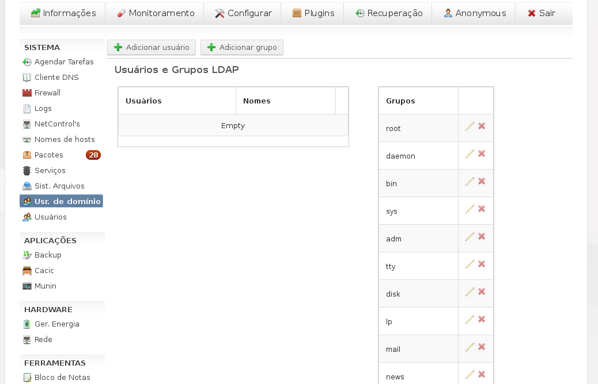
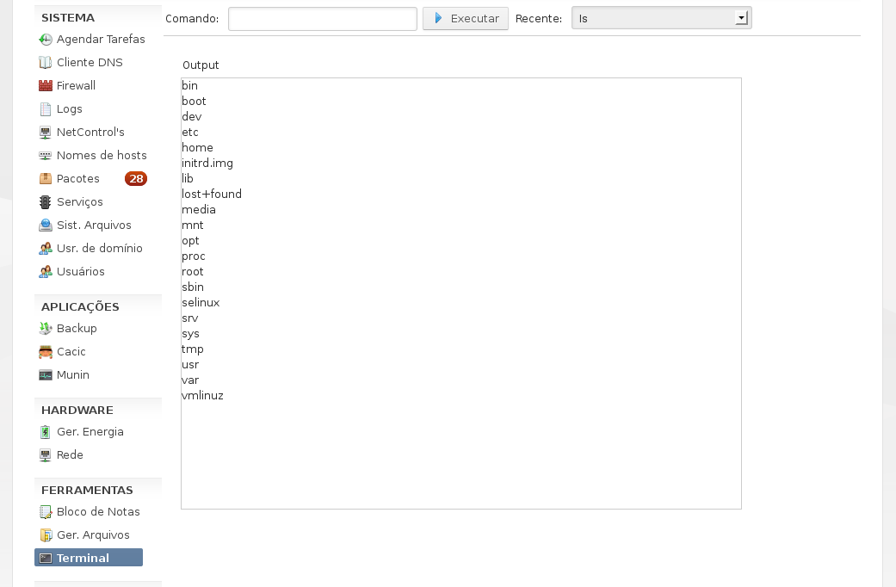
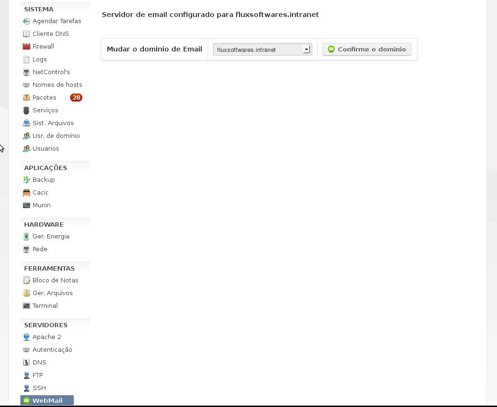

# NetControl

O NetControl é um painel de controle/configuração web autônomo (standalone) em Python que fornece um sistema de gerenciamento de servidores Debian GNU/Linux, além da autenticação/armazenamento-de-arquivos em qualquer estação (Windows e derivados de GNU/Linux) compatível com openLDAP.

Através de seus módulos é possível configurar os serviços do servidor pela Web. Sendo necessário somente um navegador web (recomendado: Firefox) e a liberação do IP de acesso. Sua interface web é simplificada e fornece seus recursos de forma fácil para os administradores de sistemas.

Dentre seus módulos, o de maior destaque é o LDAP, que permite que estações GNU/Linux e Windows funcionem sob o mesmo servidor LDAP (para autenticação de usuário) e de arquivos. Olhe a Figura 28 à 34.

Suas telas são apresentadas a seguir.

*NOTA: Seu desenvolvimento ocorreu dentre 2011 à 2012. Funciona corretamente com a versão Debian Squeeze e precisa de atualização. Estou procurando contribuidores com o projeto. :)*

### Tela de Acesso Inicial

||
:-------------:
|**Fig. 01. Tela inicial**|

||
:-------------:
|**Fig. 02. Tela de autenticacao**|

### Configurações de Acesso à Web

||
:-------------:
|**Fig. 03. Acesso-bloqueio**|

||
:-------------:
|**Fig. 04. Acesso-Usuarios**|

||
:-------------:
|**Fig. 05. Acesso-Bloqueio-Sites**|

||
:-------------:
|**Fig. 06. Acesso-Liberação-Sites**|

### Configuração do Apache

||
:-------------:
|**Fig. 07. Configuração do apache**|

||
:-------------:
|**Fig. 10. Configuração do Apache-02**|

### Backup do servidor

||
:-------------:
|**Fig. 08. Backup-01**|

||
:-------------:
|**Fig. 09. Backup-02**|

### Utilização do Cacic

||
:-------------:
|**Fig. 11. Cacic**|

### Configuração do DNS

||
:-------------:
|**Fig. 12. DNS-01**|

||
:-------------:
|**Fig. 13. DNS-02**|

||
:-------------:
|**Fig. 14. DNS-03**|

||
:-------------:
|**Fig. 15. DNS-04**|

||
:-------------:
|**Fig. 16. DNS-05**|

||
:-------------:
|**Fig. 17. DNS-06**|

||
:-------------:
|**Fig. 18. DNS-07**|

||
:-------------:
|**Fig. 19. DNS-08**|

||
:-------------:
|**Fig. 20. DNS-10**|

### Configuração de energia

||
:-------------:
|**Fig. 21. Energia**|

### Estações que possuem o cliente do NetControl

||
:-------------:
|**Fig. 22. Estacoes**|

### Configuração do Firewall (IPTables)

||
:-------------:
|**Fig. 23. Firewall-01**|

||
:-------------:
|**Fig. 24. Firewall-02**|

### Configuração do FTP

||
:-------------:
|**Fig. 25. FTP**|

### Gerenciador de arquivos

||
:-------------:
|**Fig. 26. Gerenciador de arquivos**|

### Gerenciador de tarefas

||
:-------------:
|**Fig. 27. Gerenciador de tarefas**|

### Configuração automática do LDAP

||
:-------------:
|**Fig. 28. LDAP-01**|

||
:-------------:
|**Fig. 29. LDAP-02**|

||
:-------------:
|**Fig. 30. LDAP-03**|

||
:-------------:
|**Fig. 31. LDAP-04**|

### Configuração dos usuários do LDAP

||
:-------------:
|**Fig. 32. LDAP-Usuários-01**|

||
:-------------:
|**Fig. 33. LDAP-Usuários-02**|

||
:-------------:
|**Fig. 34. LDAP-Usuários-03**|

### Registros (Logs) do sistema

||
:-------------:
|**Fig. 35. Logs**|

### Configuração de terminal remoto

||
:-------------:
|**Fig. 36. LTSP-01**|

||
:-------------:
|**Fig. 37. LTSP-02**|

||
:-------------:
|**Fig. 38. LTSP-03**|

### Acesso ao Munin

||
:-------------:
|**Fig. 39. Munin**|

### Pacotes do Sistema

||
:-------------:
|**Fig. 40. Pacotes-01**|

### Configuração da Rede

||
:-------------:
|**Fig. 43. Rede-01**|

||
:-------------:
|**Fig. 41. Rede-02**|

||
:-------------:
|**Fig. 42. Rede-03**|

### Exportação de arquivos com o Samba

||
:-------------:
|**Fig. 46. Samba**|

### Serviços do Sistema

||
:-------------:
|**Fig. 47. Serviços do sistema**|

### Sistemas de arquivos (fstab)

||
:-------------:
|**Fig. 48. Sistema de Arquivos**|

### Terminal online

||
:-------------:
|**Fig. 49. Terminal Online**|

### Configuração dos usuários locais

||
:-------------:
|**Fig. 50. Usuários Locais**|

## Configuração do WebMail

||
:-------------:
|**Fig. 51. Configuração do Webmail-01**|

||
:-------------:
|**Fig. 52. Acesso ao webmail (Roundcube-01)**|

||
:-------------:
|**Fig. 53. Acesso ao webmail (Roundcube-02)**|
